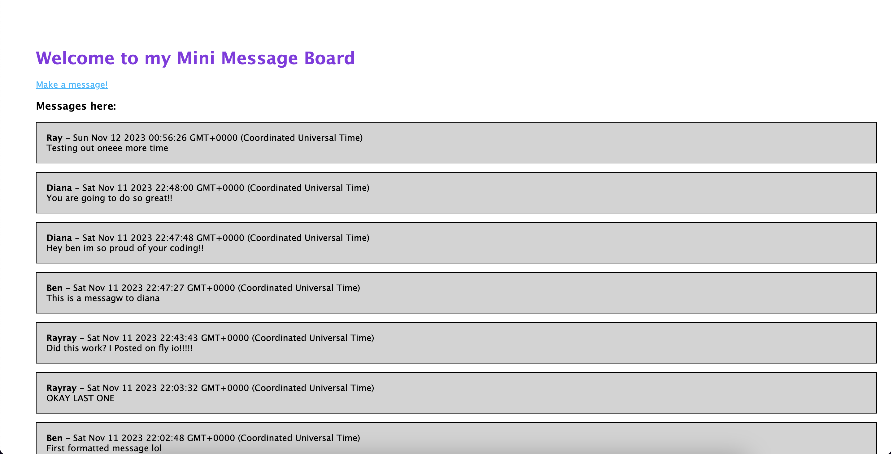

# Project: Mini Message Board

### Result

### [Link to Page](https://polished-water-2695.fly.dev/)

### About the project

[Link to project assignment](https://www.theodinproject.com/lessons/nodejs-mini-message-board)

First project with Node.JS, Express, MongoDB, Pug and a backend!! This is so excited, I had a lot of fun implementing this and creating this very simple but new project.

### Objectives

- [x] Setup express project
- [x] Create basic site with '/' page and '/new' form page
- [x] Link form page to push into locally hosted messages array
- [x] Connect to MongoDB and correctly push new messages to the database
- [x] Retrieve data from MongoDB and display it correctly on the website with Pug
- [x] Launch and deploy with correct database and hiding keys with Fly.io

### What I learned:

- Main concepts:
  - Basic Node.JS
  - MongoDB creating and reading data
  - Pug
  - Launching and deploying a app with a backedn
